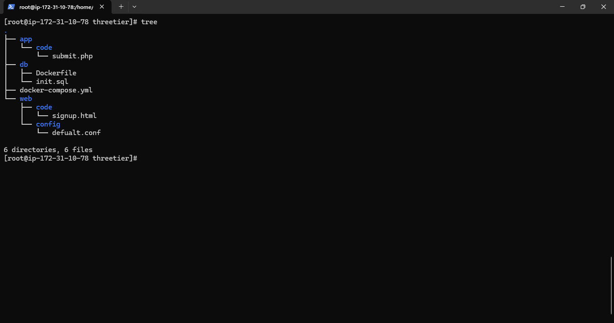
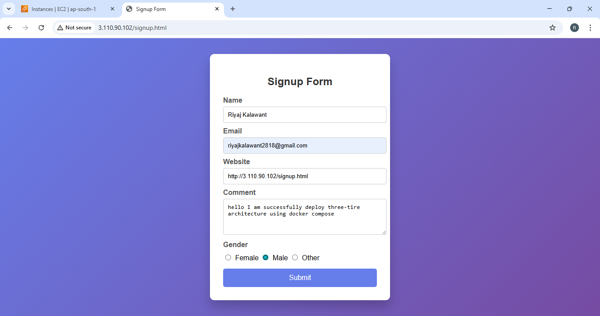
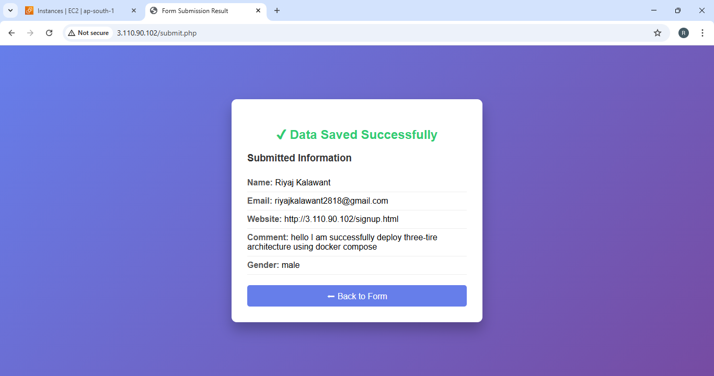
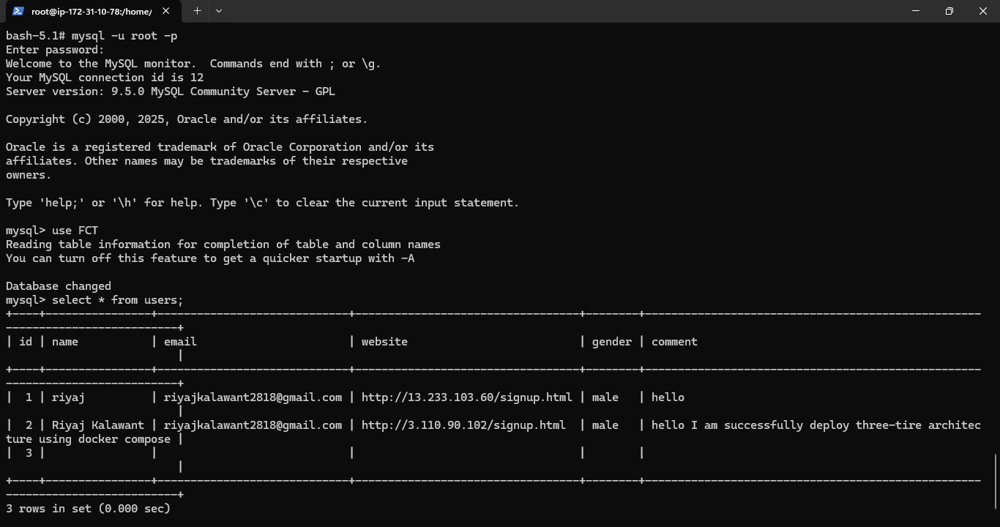
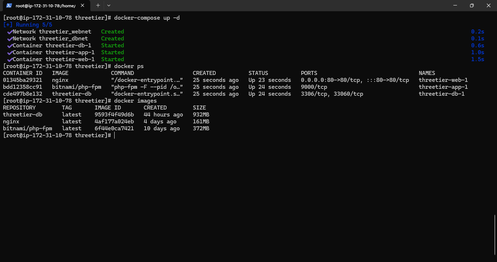

# Three-Tier Web Application


This is a **Three-Tier Web Application** deployed using Docker.  

- **Web Layer:** Nginx serving the frontend (`signup.html`)  
- **App Layer:** PHP handling form submissions (`submit.php`)  
- **Database Layer:** MySQL storing user data  

---

##  Project Structure

threetier/
├── app/
│ └── code/submit.php
├── db/
│ ├── Dockerfile
│ └── init.sql
├── web/
│ ├── code/signup.html
│ └── config/defualt.conf
└── docker-compose.yml

yaml
Copy code

**Project Tree Screenshot:**  
  

---

##  Features

-  **signup form** with CSS styling  
- **PHP backend** for form submission  
- **MySQL database** for storing user information  
- **Nginx reverse proxy** to route requests to PHP  
- Safe output using `htmlspecialchars()`  
- Easy deployment using **Docker Compose**  

---

## 🖼️ Screenshots

**Signup Form:**  
  

**Form Submission Success:**  
  

**Data Saved in Database (MySQL Table Preview):**  
  

**Docker Containers Running:**  
  

> Replace these images in `/images` folder with your actual screenshots.

---

##  How to Run

1. Clone the repository:

```bash
git clone <https://github.com/Riyajkalawant/three-tire-using-docker-compose-.git>
cd threetier
Build and start containers:

bash
Copy code
docker-compose down
docker-compose build
docker-compose up -d
```
##  Open browser:
Paste your server ip 
http://<your-server-ip>/signup.html
Fill and submit the form → data will be saved in MySQL database


 ## PHP Database Connection
php
$servername = "db";  // Docker service name
$username   = "root";
$password   = "root";
$dbname     = "FCT";
Form action in signup.html:

## html
<form action="/submit" method="post">
Nginx forwards /submit requests to the app container

##  Conclusion 
This Three-Tier Web Application demonstrates a complete DevOps workflow:

Frontend served by Nginx

Backend handled by PHP

Persistent data stored in MySQL

All components containerized using Docker and orchestrated with Docker Compose

By following this setup, you can:

Quickly deploy a scalable web application

Easily manage multiple layers independently

Learn and implement 3-tier architecture in real-world projects

Ensure data security and safe form handling with PHP

This project can serve as a foundation for more advanced full-stack applications, including adding authentication, API integrations, or front-end frameworks.# three-tire-using-docker-compose-